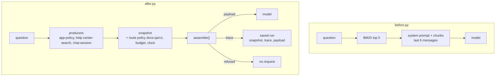

# 01 · Help-center Q&A, before and after CWA

A chat bot that answers questions about Fernway, a fictional team task tracker, from its 21-article help center. It is written twice:

- [before.py](before.py) is the bot as it is usually written. It retrieves chunks with LlamaIndex, pastes them into the system prompt, keeps the last six messages, and sends the request.
- [after.py](after.py) is the same bot with CWA. Three producers propose context, a frozen snapshot holds it with the route's policy, and the [reference assembler](https://github.com/contextwindowarchitecture/assembler-python) decides what is sent and records why.

Same corpus, same retriever, same instructions, same model SDKs. Only `build_request()` changes.

## Run it

```sh
uv sync
uv run pytest
uv run after.py "Why didn't I get my password reset email?"
uv run before.py "Why didn't I get my password reset email?"
```

Without a provider, both apps print the request they would send instead of sending it, so you need no API key to see the difference. [Sending it to a model](#sending-it-to-a-model) covers the rest.

## What changes



The difference is in one function. In `before.py`:

```python
def build_request(conversation):
    _, instructions = corpus.front_matter(INSTRUCTIONS.read_text(encoding="utf-8"))
    hits = corpus.retrieve(conversation.question, TOP_K)
    articles = "\n\n".join(f"[{hit.node.node_id}] {hit.node.get_content()}" for hit in hits)
    system = f"{instructions}\n\nHelp-center articles:\n\n{articles}"
    messages = [{"role": turn.role, "content": turn.text} for turn in conversation.turns[-MAX_HISTORY_MESSAGES:]]
    messages.append({"role": "user", "content": conversation.question})
    return [system], messages
```

In `after.py`:

```python
def build_request(conversation):
    document = context.snapshot(conversation)  # freeze: what each producer proposed, the route's policy, the clock
    return document, context.assemble(document)  # decide: admission, fitting, rendering; no I/O, no model call
```

The decisions `before.py` makes inline, such as how many chunks, how much history, and whether to answer at all, move into [policy/route-policy.json](policy/route-policy.json), where they are versioned and applied by the assembler, and every one is recorded.

| | before.py | after.py |
| --- | --- | --- |
| Weak retrieval hits | All five are sent, whatever they score | Chunks under the route's `min_relevance` are left out, each with a `below_threshold` row and its score |
| A long conversation | The last six messages, counted by message | The newest turns that fit the history slot's 350-token cap; each older turn is an `over_budget` row |
| A question the docs can't answer | Sent anyway, with five unrelated chunks; the model may or may not decline | Refused with `evidence_required` before any model call |
| Retrieved text | Inside the system prompt, beside the instructions | Inside `<article>` tags in the user message, escaped, marked as untrusted content (R-10) |
| Earlier answers | Replayed as real assistant messages | A transcript inside the user message, each turn marked `speaker="assistant"` or `"user"` (R-7) |
| Debugging an answer later | Whatever you logged | `runs/<digest>/snapshot.json` replays to the same request, byte for byte (R-23) |

## Three scenarios

Each is committed under [scenarios/](scenarios/) with the snapshot, trace and payload it produces, so you can read them without running anything.

### 01 · A question the help center answers

```console
$ uv run after.py --conversation scenarios/01-answer/conversation.json
assembled docs-qa-messages v1: 283 input tokens of 1500 with a 15% margin, sha256 534bee41a566
  + governance.instructions  policy:instructions           142 tokens
  + evidence.knowledge       help:sign-in@6#0               58 tokens  relevance 3.693
  + evidence.knowledge       help:sign-in@6#1               39 tokens  relevance 2.091
  + interaction.query        turn:s_01answer:0001           11 tokens
  - evidence.knowledge       help:sign-in@6#3             below_threshold  relevance 1.839
  - evidence.knowledge       help:status-and-uptime@3#0   below_threshold  relevance 1.636
  - evidence.knowledge       help:support@2#1             below_threshold  relevance 1.754
```

The retriever proposed five chunks. Two clear the route's threshold of 2.0 and are sent. The other three are left out, and the trace says which, and by how much. `before.py` sends all five, including the status-page paragraph.

### 02 · A conversation longer than the history allows

```console
$ uv run after.py --conversation scenarios/02-long-conversation/conversation.json
assembled docs-qa-messages v1: 815 input tokens of 1500 with a 15% margin, sha256 f5289c5dca41
  ...
  + interaction.history      turn:s_02long:0003             14 tokens
  + interaction.history      turn:s_02long:0004             72 tokens
  + interaction.history      turn:s_02long:0005             19 tokens
  + interaction.history      turn:s_02long:0006             55 tokens
  + interaction.history      turn:s_02long:0007             23 tokens
  + interaction.history      turn:s_02long:0008             55 tokens
  + interaction.query        turn:s_02long:0009             21 tokens
  - interaction.history      turn:s_02long:0001           over_budget
  - interaction.history      turn:s_02long:0002           over_budget
```

Eight prior turns about setting up SSO with Okta, then a question about the Team plan. The history slot's cap is 350 tokens, so the assembler drops the oldest turns until the rest fit, newest first. Here `before.py` keeps the same six turns by counting messages. The difference shows when one message is long: a pasted log counts as one message in `before.py`, and by its tokens in `after.py`. Either way, only the trace says that turns 1 and 2, where the user said they're on the Business plan, were not sent.

### 03 · A question the help center can't answer

```console
$ uv run after.py --conversation scenarios/03-off-topic/conversation.json
refused: evidence_required, recovery request_context. No request is sent.
  - evidence.knowledge       help:api@5#0                 below_threshold  relevance 0
  - evidence.knowledge       help:api@5#1                 below_threshold  relevance 1.201
  - evidence.knowledge       help:api@5#2                 below_threshold  relevance 0
  - evidence.knowledge       help:api@5#3                 below_threshold  relevance 0
  - evidence.knowledge       help:notifications@5#1       below_threshold  relevance 1.273
```

Three of the five chunks share no word with the question and score 0. Retrieval ranks every chunk by score and then by chunk id, so ties like these resolve the same way on every machine, and this scenario's committed files hold on Linux CI as on a Mac.

"What's a good recipe for banana bread?" No chunk clears the threshold, and the route sets `requires_evidence`, so the assembler refuses (R-12). There is no payload, so no request can be made. The recovery action, `request_context`, tells the application what to do next; in chat, the bot asks the user to rephrase. `before.py` sends the question with five unrelated chunks. A capable model usually declines, as the instructions ask, but that costs a model call and depends on the model following its instructions. CWA enforces the rule outside the model (R-5).

## The policy

[policy/route-policy.json](policy/route-policy.json) is version `docs-qa/v1` of the route:

| Setting | Value | Effect |
| --- | --- | --- |
| `producers` | `app-policy`, `help-center-search`, `chat-session` | Which producers the route accepts and which slots each may fill. Anything else is excluded (R-15) |
| `requires_evidence` | `true` | No help-center chunk, no answer (R-12) |
| `evidence.knowledge.min_relevance` | `2.0` | The BM25 score a chunk needs. The retriever's scale, the route's threshold (R-13) |
| `interaction.history.max_tokens` | `350` | The history slot's share of the request; the oldest turns go first (R-16) |
| `interaction.history.required_scope` | `["session"]` | A turn from another session is excluded `out_of_scope`, never sent (R-2) |
| `fitting_order` | history, then knowledge | What gives way first if the request is over budget |

[policy/assembly.json](policy/assembly.json) sets the budget (1,500 input tokens, 16,000 reserved for output), the tokenizer (`estimate-utf8/v1`, bytes divided by four, with a 15% margin because it estimates), and the renderer (`cwa-messages/v1`, which keeps the instructions in the system channel and everything else in one user message). [policy/profile.json](policy/profile.json) places the slots. Changing the order, the wrappers or the model target means a new profile version (R-20).

The threshold of 2.0 was chosen by reading scores for a set of questions. It admits the relevant chunks for most of them and refuses the off-topic ones. A lexical retriever has limits: "How do recurring tasks work?" loses one relevant paragraph at 1.58. Changing the threshold is a policy change: give the route a new version, run `uv run scenarios.py --write`, and review what moved.

## Files

| File | What it does |
| --- | --- |
| [before.py](before.py), [after.py](after.py) | The two apps. Same command line |
| [producers.py](producers.py) | The three producers: instructions, one scored item per retrieved chunk, and the session's turns and question |
| [context.py](context.py) | Freezes a question's snapshot and calls `assemble()` |
| [corpus.py](corpus.py) | The help center as LlamaIndex nodes, one per paragraph, and the BM25 retriever. Shared by both apps |
| [providers.py](providers.py) | The request through the official `anthropic` or `openai` SDK. Shared by both apps |
| [conversation.py](conversation.py), [cli.py](cli.py) | A chat session, and the command line both apps share |
| [scenarios.py](scenarios.py) | Rebuilds or checks the committed scenarios |
| [help-center/](help-center/) | The corpus: 21 articles with front matter (id, title, version, updated) |
| [policy/](policy/) | The instructions, the route policy, the placement profile and the assembly settings |
| [tests/](tests/) | The scenarios are current and replay, and each claim in this README holds |

## Sending it to a model

Pick a provider with `--provider` or `DOCS_QA_PROVIDER`, and a model with `--model` or `DOCS_QA_MODEL`. Copy [.env.example](.env.example) to `.env` and run through `uv run --env-file .env`.

The Claude API, with `ANTHROPIC_API_KEY` or after `ant auth login` (the model defaults to `claude-opus-5-5`, at low effort, with server-side refusal fallbacks):

```sh
uv run after.py --provider anthropic "How do I set up SSO with Okta?"
```

OpenAI, or any OpenAI-compatible server, such as a local model:

```sh
OPENAI_BASE_URL=http://127.0.0.1:8000/v1 uv run after.py --provider openai --model gpt-oss-20b-MXFP4-Q8 "How do I set up SSO with Okta?"
```

An Anthropic-compatible local server works through `ANTHROPIC_BASE_URL` with `--provider anthropic`.

Leave out the question to chat. Each turn is assembled from a new snapshot, the decision table prints before every answer, and the history grows until the route's cap starts dropping old turns:

```console
$ uv run after.py --provider openai
Ask about Fernway (session s_355242e5). Ctrl-D to quit.

you> How do I set up SSO with Okta?
...
you> Tell me a joke
refused: evidence_required, recovery request_context. No request is sent.
...
fernway> I couldn't find that in the Fernway help center. Could you rephrase or add detail? You can also reach support@fernway.example.
```

## Replaying a request

Every assembly is saved under `runs/<digest>/` (gitignored): `snapshot.json`, `trace.json`, and `payload.json` unless it was refused. The snapshot holds everything that decided the request, the clock included, so it replays to the same bytes on any machine:

```console
$ uv run after.py --replay runs/<digest>/snapshot.json
assembled docs-qa-messages v1: 815 input tokens of 1500 with a 15% margin, sha256 f5289c5dca41
...
replay: same outcome, byte for byte
```

When a user reports a bad answer, the snapshot shows what the model was given. You can then check it against a new policy or a new assembler before you ship either.

## Recording a run

`--record DIR` keeps one question's run in a folder you name, to read or compare later, such as the same question sent to two models:

```sh
uv run --env-file .env after.py --provider anthropic --record runs/sso "How do I set up SSO with Okta?"
uv run --env-file .env before.py --provider anthropic --record runs/sso-before "How do I set up SSO with Okta?"
```

| File | `after.py` | `before.py` |
| --- | --- | --- |
| `conversation.json` | The question and the turns before it. `--conversation` asks it again | The same |
| `snapshot.json`, `trace.json`, `payload.json` | The assembly, as under `runs/<digest>/`. No `payload.json` when refused | None: nothing recorded what was left out |
| `request.json` | | The system text and messages it built |
| `run.json` | The provider and model, and the answer, or the error. The answer is null when nothing was sent | The same |

## Context changes in review

`uv run pytest` rebuilds each scenario from its `conversation.json` and compares it with the committed `snapshot.json`, `trace.json` and `payload.json`. Edit an article, the instructions or the route policy, and the suite fails:

```console
$ uv run pytest -q
FAILED tests/test_scenarios.py::test_the_committed_scenario_is_what_the_code_builds_now[01-answer]
```

Run `uv run scenarios.py --write`, and the pull request shows exactly how the context the model receives changed: which chunks moved in or out, which turns fit, and the new request bytes. When you edit an article, bump its `version`. Chunk ids carry it, so a citation always refers to the text it was made against.

## Limits

- BM25 is lexical. "SSO" and "single sign-on" are different words to it. Swapping in embeddings or a reranker changes only `help_center_search()` in [producers.py](producers.py), plus the threshold, since the scale changes.
- `estimate-utf8/v1` estimates tokens, so the route reserves a 15% margin. To count exactly, pass your model's tokenizer to `Snapshot.from_json` (see the assembler's README).
- The profile is unevaluated (R-19): its placement is a reasonable default, not a measured one.
- One user, one session, no memory, no tools. Those come next.

## Next

02 adds per-user account state and memory to this bot: scope, expiry, and a declared conflict when a memory disagrees with the account.
