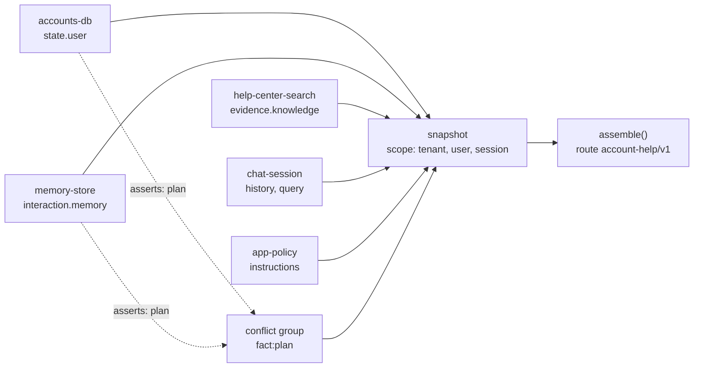

# 02 · Account-aware answers: state, memory, scope and conflicts

[01](../01-docs-qa/) answers from the help center alone, so everyone gets the same answer. Ask it "Can we turn on single sign-on?" and it explains how. That is wrong for anyone on the Team plan, which doesn't include SSO.

This example gives the bot two more sources, the two most assistants add next:

- **Account state.** The workspace's plan and the user's role, read from the accounts database when the question is asked.
- **Memory.** Notes saved from the user's earlier conversations, such as "uses Okta" or "prefers numbered steps".

Each new source can be wrong in a familiar way. A memory goes out of date: the user said "we're on Team" in July, and the workspace upgraded in September. A memory outlives what the user agreed to: it expired, or the user asked the bot to forget it. Or a bug in the memory query returns a teammate's memories. 02 shows CWA handling each case through declared policy and recording it in the trace.

## Run it

```sh
uv sync
uv run pytest
uv run app.py --user u_cho "Can we turn on single sign-on for our workspace?"
uv run app.py --user u_ada "Can we turn on single sign-on for our workspace?"
```

`--user` picks who is signed in, from [data/accounts.json](data/accounts.json):

| User | Workspace | Plan | Role | Memories in [data/memories.json](data/memories.json) |
| --- | --- | --- | --- | --- |
| `u_cho` | Larkspur Design | Team | Admin | prefers numbered steps; an expired one; one the user asked to forget |
| `u_ada` | Kitewood Studio | Business, since September | Owner | uses Okta; "on the Team plan", from July |
| `u_ben` | Kitewood Studio | Business | Member | mostly uses the iOS app |

## What 02 adds to 01

`app.py` is 01's `after.py`. The question still goes through producers, a snapshot and `assemble()`. The differences are in the producers and the policy:



| | 01 | 02 |
| --- | --- | --- |
| Producers | instructions, help center, chat | the same, plus `accounts-db` (kind `state`) and `memory-store` (kind `memory`) |
| Request scope | session | tenant (the workspace), user and session. An item scoped to anyone else is `out_of_scope` (R-2) |
| Account state | none | `state.user`, admitted for 300 seconds after it was read (R-8), and protected by the route, so it is never dropped for budget (R-16) |
| Memory | none | `interaction.memory`, each with an expiry and the turn it came from (R-9). Expired and revoked memories are dropped by the producer and reported without their text (R-14) |
| Conflicts | none | When two items assert the same fact, the application declares a group. The route's `facts.plan` ranks the accounts database above memory (R-11) |
| Instructions | answer from the articles | also answer for the user's plan and role, and treat memories as possibly out of date |

## Three scenarios

The same question goes to two workspaces, and a third user runs with an injected fault.

### 01 · A Team-plan admin asks about SSO

```console
$ uv run app.py --conversation scenarios/01-team-plan/conversation.json
assembled account-help-messages v1: 679 input tokens of 2000 with a 15% margin, sha256 6be03c7a4538
  + governance.instructions  policy:instructions           244 tokens
  + state.user               account:w_larkspur:plan        27 tokens
  + state.user               account:w_larkspur:u_cho       12 tokens
  + evidence.knowledge       help:plans@9#4                 30 tokens  relevance 2.243
  ...
  + interaction.memory       mem:u_cho:0001                 11 tokens
  + interaction.query        turn:s_01team:0001             12 tokens
  - (by memory-store)        mem:u_cho:0002               expired
  - (by memory-store)        mem:u_cho:0004               revoked
```

The account says Larkspur Design is on the Team plan, so the model says SSO needs Business instead of walking through the setup. Cho's memories are filtered by the producer. The 2025 trial memory expired in January. The note about a manager approving plan changes was revoked when Cho asked the bot to forget it. Neither memory's text enters the snapshot, so it cannot reach the model. The trace still records both by id.

A local gpt-oss-20b answered:

> No – Single Sign‑On (SSO) is not available on the Team plan. To enable SSO you would need to upgrade your workspace to the Business plan [...] [help:plans@9#4][help:sso@8#0]

### 02 · A memory that is out of date

```console
$ uv run app.py --conversation scenarios/02-memory-disagrees/conversation.json
assembled account-help-messages v1: 680 input tokens of 2000 with a 15% margin, sha256 a002ea1bbb4f
  + governance.instructions  policy:instructions           244 tokens
  + state.user               account:w_kitewood:plan        28 tokens
  + state.user               account:w_kitewood:u_ada       12 tokens
  ...
  + interaction.memory       mem:u_ada:0005                 10 tokens
  + interaction.query        turn:s_02memory:0001           12 tokens
  - interaction.memory       mem:u_ada:0003               conflict_lost
  ! fact:plan                account:w_kitewood:plan, mem:u_ada:0003: decided by policy, account:w_kitewood:plan prevails
```

In July, Ada told the bot her workspace was on the Team plan, and the memory store saved it. Kitewood upgraded to Business in September. Both items claim the plan. The memory store tags its memory with the fact it asserts, so [context.py](context.py) declares a `fact:plan` group. The route's precedence for `plan` lists `accounts-db` first, so the account prevails and the July memory is left out as `conflict_lost`.

The assembler never reads "Team" or "Business" in the bodies. It decides by which producer asserted each claim, as the route lists them. Ada's other memory, that she uses Okta, is still sent, and the answer uses it:

> Yes – SSO is available on the Business plan [...] Copy Fernway's ACS URL and Entity ID and add a new SAML app in Okta (your identity provider)

### 03 · The memory store returns the wrong user's memories

```console
$ uv run app.py --conversation scenarios/03-memory-leak/conversation.json
assembled account-help-messages v1: 611 input tokens of 2000 with a 15% margin, sha256 db10d680d6be
  ...
  + interaction.memory       mem:u_ben:0001                 14 tokens
  + interaction.query        turn:s_03leak:0001             11 tokens
  - evidence.knowledge       help:support@2#1             below_threshold  relevance 1.149
  - interaction.memory       mem:u_ada:0003               out_of_scope
  - interaction.memory       mem:u_ada:0005               out_of_scope
  ! fact:plan                account:w_kitewood:plan, mem:u_ada:0003: moot, fewer than two members admitted
```

Ben, Ada's teammate, asks about push notifications. The scenario injects a fault, `memory-store-ignores-user`: the memory store's query filters by workspace only, a bug that is easy to write. Ada's two memories reach the snapshot.

Each memory carries the scope it was saved under, `{tenant, user}`, and the request's scope says Ben is asking. The assembler excludes Ada's memories as `out_of_scope` whatever the producer did. Only Ben's memory, that he mostly uses the iOS app, is sent. The plan group is moot because Ada's memory never got past admission.

This is defense in depth, not a reason to skip the filter. The trace makes the bug visible: two `out_of_scope` rows on every one of Ben's requests are an alert worth wiring up.

## The policy

[policy/route-policy.json](policy/route-policy.json) is `account-help/v1`. On top of 01's rules:

| Setting | Value | Effect |
| --- | --- | --- |
| `producers.accounts-db` | kind `state`, slot `state.user` | Only a producer of kind `state` may write state (R-8) |
| `producers.memory-store` | kind `memory`, slot `interaction.memory` | A memory producer can send nothing else, whatever the route lists (R-14) |
| `state.user.max_age_seconds` | `300` | An account read more than five minutes before the question is `stale_state` (R-8) |
| `state.user.required_scope` | `["tenant"]` | Account state must name the workspace it describes |
| `interaction.memory.required_scope` | `["tenant", "user"]` | A memory must name its workspace and user; one for another user is `out_of_scope` |
| `interaction.memory.source_prefix` | `"turn:"` | A memory must name the conversation turn it came from (R-9) |
| `tier_upgrades` | `state.user`: `protected` | The account is never dropped to fit the budget (R-16) |
| `facts.plan` | `accounts-db`, then `memory-store`; `on_unresolved: refuse` | Who wins a disagreement about the plan, by producer identity (R-11) |

Because the account is protected, no policy can let a memory beat it. Conflict resolution never excludes a protected item (R-11). Reverse `facts.plan.precedence` and the group escalates: the assembly refuses with `conflict_unresolved` rather than send the July memory without the account.

The instructions say the same thing in words: "on plan and role, the account details are current". The model gets the guidance, and the rule holds without depending on the model to follow it (R-5).

## Files

New or changed since 01:

| File | What changed |
| --- | --- |
| [producers.py](producers.py) | `accounts_db()` and `memory_store()`. Each returns its batch and the facts its items assert |
| [context.py](context.py) | `conflict_groups()`, and the request's scope now names the tenant and the user |
| [conversation.py](conversation.py) | A conversation knows its workspace and user, and can carry injected faults |
| [app.py](app.py) | 01's `after.py`, with producer-reported exclusions and conflict groups in the decision table |
| [cli.py](cli.py) | `--user` picks who is signed in |
| [data/](data/) | The accounts database and the memory store |
| [policy/](policy/) | The `account-help/v1` route, a profile that places `<account>` and `<memory>`, and instructions version 2 |

The help center, the retriever and the providers are unchanged. Diff the two folders to see every line:

```sh
diff -ru -x .venv -x __pycache__ -x .pytest_cache -x runs -x scenarios ../01-docs-qa .
```

## Sending it to a model

Same as 01: `--provider anthropic` or `--provider openai`, with the settings in [.env.example](.env.example). Chat as a user with `--user`:

```sh
OPENAI_BASE_URL=http://127.0.0.1:8000/v1 uv run app.py --provider openai --model gpt-oss-20b-MXFP4-Q8 --user u_ben
```

## Limits

- Memories here are written by hand. A real store also saves them from conversations, and the step that decides what to remember, and which fact a memory asserts, is where an application needs the most care. CWA starts at the point where a memory is a candidate.
- Conflict groups are declared by fact key: the memory store tags a memory that states the plan. A memory that implies the plan without a tag ("we can't use SSO yet") is not grouped. The instructions are the fallback for those.
- The account is read on every question, so it is never stale here. An app that caches the account per session would see `stale_state` after five minutes, and should refresh the account and assemble again.

## Next

03 adds summaries computed ahead of time as variants, so a long conversation or a long article shrinks instead of being dropped, and a second model route with its own placement profile.
