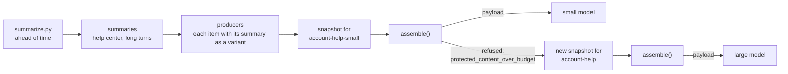

# 03 · Budgets and routes: summaries computed ahead of time, and two model routes

[02](../02-account-aware/) sends one request shape to one model, with room to spare. Real applications run more than one model: a small, fast one for most questions and a large one for the hard or long ones. A small model's budget runs out quickly, and the usual fix is to truncate whatever is at the end of the string.

This example runs the 02 bot on two routes:

- **`account-help-small`**, a small model with a 1,000-token input budget, tried first.
- **`account-help`**, a large model with 6,000.

Each route has its own CWA route policy and placement profile. When the small route's budget is tight, long conversation turns and long help-center paragraphs are sent as summaries written ahead of time. The oldest turns are dropped only after that, and the trace records each substitution. When even the parts that must be sent whole don't fit, such as a pasted log, the small route refuses and the application rebuilds the snapshot on the large route.

## Run it

```sh
uv sync
uv run pytest
uv run app.py --conversation scenarios/02-small-route/conversation.json
uv run app.py --route account-help --conversation scenarios/02-small-route/conversation.json
```

## What 03 adds to 02



| | 02 | 03 |
| --- | --- | --- |
| Routes | one | two, in [policy/routes.json](policy/routes.json): each names its route policy, profile, budget and model per provider |
| Variants | none | each help-center paragraph and each long turn carries its summary as a variant (R-18) |
| Fitting | omit history, then memory, then articles | compress history, then articles, and only then omit (R-16) |
| Placement | one profile | the large route puts articles before history; the small route puts them last, beside the question |
| A request that can't fit | refused | refused on the small route, then rebuilt on the large route as a new snapshot (R-12) |

### Summaries are written before assembly, never during it

Assembly can't call a model (R-18), so a summary has to exist before the snapshot is frozen. [summarize.py](summarize.py) writes them:

```sh
OPENAI_BASE_URL=http://127.0.0.1:8000/v1 uv run summarize.py --provider openai --help-center
```

It writes one sentence per help-center paragraph to [help-center/summaries.json](help-center/summaries.json). Each summary is keyed by the SHA-256 of the paragraph it was made from, so an edited paragraph has no summary until the script runs again. A stale summary is never offered (`corpus.summary()`). In chat, `app.py` summarizes a turn of more than about 40 tokens when it saves the turn. Each summary records how it was made, for example `summarize/v1 gpt-oss-20b-MXFP4-Q8`. The trace repeats that as the `method` of every substitution.

**Read the summaries before you commit them.** A variant must not add an instruction or a fact (R-18), and models write unfaithful summaries. The first pass for this example, with a local gpt-oss-20b, got five of 80 wrong:
- "a workspace has one Owner", where the article says at least one
- SCIM set up "into Entra ID", dropping Okta
- the SSO sign-in summary dropped the one fact the paragraph exists for
- the magic-link summary dropped "works once"
- one came back garbled

Each was regenerated and checked again. The assembler can check that a variant is shorter. Only a reader can check that it's true.

## Four scenarios

The same eight-turn conversation runs on each route, and a pasted log runs on each route. It is Ada's SSO setup from 01, with the account and memory from 02, ending in "Before we turn on Require SSO, I want a full backup. How do I export the whole workspace?"

### 01 · The large route sends everything as written

```console
$ uv run app.py --conversation scenarios/01-large-route/conversation.json
route account-help
assembled account-help-messages v2: 1209 input tokens of 6000 with a 15% margin, sha256 9863200abd24
  ...
  + interaction.history      turn:s_long:0001               29 tokens
  + interaction.history      turn:s_long:0002              113 tokens
  ...
  + interaction.history      turn:s_long:0008               55 tokens
  + interaction.query        turn:s_long:0009               23 tokens
```

Every turn and every article is sent in full. The summaries are in the snapshot, unused.

### 02 · The small route sends summaries, then drops the oldest turns

```console
$ uv run app.py --conversation scenarios/02-small-route/conversation.json
route account-help-small
assembled account-help-small-messages v1: 819 input tokens of 1000 with a 15% margin, sha256 aa88c1b6e329
  + governance.instructions  policy:instructions           244 tokens
  + state.user               account:w_kitewood:plan        28 tokens
  + state.user               account:w_kitewood:u_ada       12 tokens
  + interaction.memory       mem:u_ada:0005                 10 tokens
  + interaction.history      turn:s_long:0005               19 tokens
  ~ interaction.history      turn:s_long:0006               42 tokens, summary of 55
  + interaction.history      turn:s_long:0007               23 tokens
  ~ interaction.history      turn:s_long:0008               41 tokens, summary of 55
  + evidence.knowledge       help:data-export@6#0           43 tokens  relevance 3.731
  ~ evidence.knowledge       help:data-export@6#2           47 tokens, summary of 77  relevance 5.022
  ~ evidence.knowledge       help:security@5#2              51 tokens, summary of 68  relevance 3.66
  ~ evidence.knowledge       help:sign-in@6#3               37 tokens, summary of 46  relevance 3.541
  ~ evidence.knowledge       help:sso@8#3                   40 tokens, summary of 59  relevance 3.737
  + interaction.query        turn:s_long:0009               23 tokens
  - interaction.memory       mem:u_ada:0003               conflict_lost
  - interaction.history      turn:s_long:0001             over_budget
  - interaction.history      turn:s_long:0002             over_budget
  - interaction.history      turn:s_long:0003             over_budget
  - interaction.history      turn:s_long:0004             over_budget
```

`~` marks an item sent as its summary. The trace's `compressed[]` rows record each one's size before and after, its variant id and the method that wrote it. Here is what the policy did, in the order [conformance/README.md](https://github.com/contextwindowarchitecture/website/blob/main/conformance/README.md) fixes:

1. The instructions, the account and the question are protected. They are sent whole, the same 244, 40 and 23 tokens as on the large route.
2. The history slot is capped at 200 tokens. Its long turns are summarized first, oldest first, and then the oldest turns are dropped until it fits.
3. The payload, times the 15% margin, still exceeds 1,000. Following the route's `fitting_order`, articles are summarized before any more history is dropped. `data-export@6#0` stays whole because its summary is no shorter.

A local gpt-oss-20b, given this request, still answered from the export article: Settings → Data → Export workspace, as JSON, by an Owner or Admin.

### 03 · A pasted log the small route can't hold

```console
$ uv run app.py --conversation scenarios/03-pasted-log/conversation.json
route account-help-small
refused: protected_content_over_budget. No request is sent.
```

Ada pastes 45 lines of webhook delivery failures into her question: 1,640 tokens. The question is protected, so the assembler can't shorten it, and it doesn't fit 1,000 tokens even alone. Rather than drop the log's tail or the instructions, the assembly refuses (R-16, R-17).

### 04 · The same log on the large route

```console
$ uv run app.py --conversation scenarios/04-pasted-log-escalated/conversation.json
route account-help
assembled account-help-messages v2: 2300 input tokens of 6000 with a 15% margin, sha256 3478c705d19b
```

This is the request the application builds after the refusal in 03. Without a pinned route, `app.py` tries the small route, reads the refusal reason, finds `protected_content_over_budget` in the route's `escalate` map, and freezes a new snapshot for `account-help`:

```console
$ uv run app.py --provider openai --model gpt-oss-20b-MXFP4-Q8 "<the question with the pasted log>"
route account-help-small
refused: protected_content_over_budget. No request is sent.

escalating to route account-help

route account-help
assembled account-help-messages v2: 2300 input tokens of 6000 with a 15% margin, sha256 3478c705d19b

Your webhook was disabled because it hit the failure limit – 50 consecutive deliveries all timed‑out [...] [help:webhooks@2#2]
```

Both snapshots are saved under `runs/`, so the refused attempt can be replayed too. Escalation is the application's decision, not the assembler's: it builds a new snapshot and never trims a payload (R-12, R-17).

`--record DIR` also keeps the run in a folder you name, as in 01 and 02, with one folder per route tried. Here `DIR/account-help-small/` holds the refused snapshot and trace, and `DIR/account-help/` the assembly that was sent, beside `conversation.json` and `run.json` with the provider, model and answer, or the error.

## Routes

[policy/routes.json](policy/routes.json):

| | `account-help-small` | `account-help` |
| --- | --- | --- |
| Route policy | [account-help-small/v1](policy/account-help-small/route-policy.json) | [account-help/v2](policy/account-help/route-policy.json) |
| Profile | `account-help-small-messages` v1: account, memory, history, then articles beside the question | `account-help-messages` v2: account, articles, memory, history, question |
| Budget | 1,000 input, 4,000 reserved for output | 6,000 input, 16,000 reserved for output |
| History cap | 200 tokens | 1,500 tokens |
| `anthropic` | `claude-haiku-4-5` | `claude-opus-5-5`, low effort, with server-side refusal fallbacks |
| `openai` | `gpt-oss-20b-MXFP4-Q8` on a local server (`OPENAI_BASE_URL`), low reasoning effort | `openai/gpt-oss-120b` on Groq, its key from `GROQ_API_KEY` |
| Escalates | on `protected_content_over_budget`, to `account-help` | never |

These are the models this example was run against. A route's `openai` entry can name its own `base_url` and the environment variable that holds its key (`api_key_env`), so one escalation can go from a local server to a hosted one. Without them, the route uses `OPENAI_BASE_URL` and `OPENAI_API_KEY`. Replace the models with yours, or pass `--model` to send whichever route answers to that model, on the endpoint `OPENAI_BASE_URL` names. It replaces the route's settings for the provider, endpoint, key variable and effort included, as in 04 and 05; the route still sets the budget and the policy. Every trace names its route policy version and profile, so a request is never ambiguous about the rules that built it (R-20).

The two profiles place the same slots differently, and that is a choice, not a finding. Both are unevaluated (R-19). Which placement serves a small model better is a question for the evals in 05.

## Files

New or changed since 02:

| File | What changed |
| --- | --- |
| [routes.py](routes.py), [policy/routes.json](policy/routes.json) | The application's routes |
| [policy/account-help/](policy/account-help/), [policy/account-help-small/](policy/account-help-small/) | A route policy and a profile per route; compression comes first in `fitting_order` |
| [summarize.py](summarize.py) | Writes summaries ahead of time, for the help center and for a conversation file |
| [help-center/summaries.json](help-center/summaries.json) | The reviewed summaries, keyed by the hash of the text they summarize |
| [producers.py](producers.py) | Articles and turns carry their summary as a variant |
| [corpus.py](corpus.py) | `summary()` returns a chunk's summary only if it matches the chunk's current text |
| [app.py](app.py) | Chooses the route, escalates on the route's refusal reasons, marks summarized rows with `~`, and summarizes long turns as it saves them |
| [providers.py](providers.py) | Takes the route's model and request options, instead of hard-coding them |

## Limits

- BM25 scores grow with the length of the query. The pasted log's chunks score 90 to 190 against a threshold of 2.0, so the threshold means little for a long query. A reranker with a fixed scale, or retrieving on the question without the pasted material, fixes that. Either change belongs in `help_center_search()`.
- `fitting_order` here compresses history before articles and drops history before memory. Another application could rank them the other way. The order is policy, it is versioned with the route, and it is visible in the trace.
- A summary is one sentence. Several variants per item, such as a two-sentence summary and a one-line one, would let the assembler shrink an item less. The assembler picks the longest variant that fits.

## Next

04 gives the bot tools through MCP. A capability policy decides which tools the model is offered, a guard checks every call, and each step of the agent loop freezes its own snapshot.
