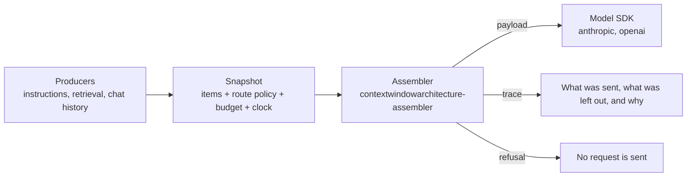

# CWA examples

Runnable applications built on the [Context Window Architecture](https://contextwindowarchitecture.io) (CWA) draft. Each one is code you could copy into your own app: it takes something people already build, a help-center bot or an agent, and shows the same app before and after CWA.

CWA treats a model request as compiled output, not a string you concatenate. Producers propose typed items (instructions, retrieved chunks, conversation turns, tool results) for named slots. The application freezes them, with a versioned route policy and a budget, into a snapshot. An assembler turns the snapshot into the request and a trace that says what was sent, what was left out and why. If the context needed to answer isn't there, it refuses before any model is called.



## The examples

Each example builds on the one before it. Together they add up to the real-world application.

| Example | What it adds | Status |
| --- | --- | --- |
| [01-docs-qa](01-docs-qa/) | A help-center Q&A bot over a fictional product's docs, with LlamaIndex retrieval. Retrieved chunks below the route's threshold, history over its cap, and questions the docs cannot answer, each decided by policy and recorded in the trace | ready |
| 02-account-aware | Per-user account state and memory: scope, expiry, and a declared conflict when the memory disagrees with the account | planned |
| 03-budget-and-routes | Summaries computed ahead of time as variants, and a second model route with its own placement profile | planned |
| 04-tools | Tools through MCP, a capability policy and a guard, in an agent loop that freezes a snapshot for every inference | planned |
| 05-production | A snapshot store with replay, traces in an observability tool, and evals | planned |

## Running one

Every example is its own [uv](https://docs.astral.sh/uv/) project and needs nothing else checked out. The assembler comes from its draft release on GitHub:

```sh
cd 01-docs-qa
uv sync
uv run pytest
uv run after.py "How do I export all my projects?"
```

No API key is needed to see what would be sent. Each example's README says how to point it at a model.

## Context as a reviewed artifact

Each example commits scenarios: a conversation in, and the snapshot, trace and exact request it produces. CI rebuilds them on every push, so editing a document, the instructions or the policy fails the build until the scenarios are regenerated. The pull request then shows exactly how the context the model receives has changed.

## Related

- [Specification](https://contextwindowarchitecture.io/spec.html): the numbered requirements cited in these examples' comments as `R-n`
- [assembler-python](https://github.com/contextwindowarchitecture/assembler-python): the reference assembler these examples depend on, with [TypeScript](https://github.com/contextwindowarchitecture/assembler-typescript) and [Go](https://github.com/contextwindowarchitecture/assembler-go) implementations
- [assembler-demo](https://github.com/contextwindowarchitecture/assembler-demo): an inspector that runs the same snapshots through all three assemblers and shows every decision

## License

Apache License 2.0: see [LICENSE](LICENSE) and [NOTICE](NOTICE). Fernway, the product in the examples' help center, is fictional.
