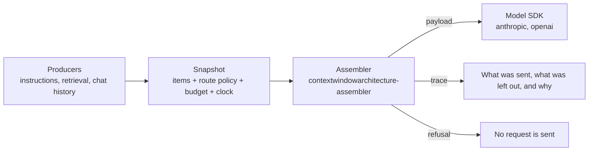

# CWA examples

Runnable applications built on the [Context Window Architecture](https://contextwindowarchitecture.io) (CWA) draft. Each one is code you could copy into your own app: it takes something people already build, a help-center bot or an agent, and shows the same app before and after CWA.

CWA treats a model request as compiled output, not a string you concatenate. Producers propose typed items (instructions, retrieved chunks, conversation turns, tool results) for named slots. The application freezes them, with a versioned route policy and a budget, into a snapshot. An assembler turns the snapshot into the request and a trace that says what was sent, what was left out and why. If the context needed to answer isn't there, it refuses before any model is called.



## The examples

Each example builds on the one before it. Together they add up to the real-world application.

| Example | What it adds | Status |
| --- | --- | --- |
| [01-docs-qa](01-docs-qa/) | A help-center Q&A bot over a fictional product's docs, with LlamaIndex retrieval. Retrieved chunks below the route's threshold, history over its cap, and questions the docs cannot answer, each decided by policy and recorded in the trace | ready |
| [02-account-aware](02-account-aware/) | The same bot, aware of who is asking: account state from a database and memories from earlier conversations. Expired and revoked memories reported by their producer, an out-of-date memory losing a declared conflict to the account, and another user's memories kept out by scope | ready |
| [03-budget-and-routes](03-budget-and-routes/) | The same bot on a small and a large model route, each with its own policy and placement. Summaries written ahead of time replace long turns and articles before anything is dropped, and a request too big for the small route is rebuilt on the large one | ready |
| [04-tools](04-tools/) | The bot as an agent with tools from an MCP server. A capability policy offers tools by role, a guard checks every call before it is made, each inference is its own snapshot, and a later look at the same thing supersedes the earlier one. An instruction injected into a tool result cannot make a call happen | ready |
| [05-production](05-production/) | The agent made production-shaped: a snapshot store with replay and what-if analysis of a candidate policy, OpenTelemetry traces of every decision, an eval suite graded against what each run did, and a deployment gate that runs only a profile evaluated for its model | ready |

## Running one

Every example is its own [uv](https://docs.astral.sh/uv/) project and needs nothing else checked out. The assembler comes from its draft release on GitHub:

```sh
cd 01-docs-qa
uv sync
uv run pytest
uv run after.py "How do I export all my projects?"
```

No API key is needed to see what would be sent. Each example's README says how to point it at a model.

## Context as a reviewed artifact

Each example commits scenarios: a conversation in, and the snapshot, trace and exact request it produces. CI rebuilds them on every push, so editing a document, the instructions or the policy fails the build until the scenarios are regenerated. The pull request then shows exactly how the context the model receives has changed.

## Releases

The CWA repositories are released under one tag name: the website, [assembler-python](https://github.com/contextwindowarchitecture/assembler-python) and the other assemblers, the demo, and these examples. Every example pins assembler-python to a tag in its `pyproject.toml`, and its `uv.lock` holds the commit that tag resolved to. [scripts/assembler_pin.py](scripts/assembler_pin.py) checks on every push that all examples pin the same tag and lock the same commit.

Pushing a tag runs [.github/workflows/release.yml](.github/workflows/release.yml):

1. Every example must pin assembler-python at that same tag, locked to the commit the tag points to now. A tag can be moved, so a lock made before the move fails here.
2. CI runs on the tagged commit.
3. A GitHub release is created. Its notes name the assembler tag and commit, then list the tag's commits, written by git-cliff from [cliff.toml](cliff.toml). A tag that is not `vX.Y.Z`, such as `draft-release`, is a prerelease.

To release at a new tag, or after the assembler's tag has moved, update every example before tagging:

```sh
# in each example: set tag = "<tag>" under [tool.uv.sources] in pyproject.toml, then
uv lock --upgrade-package contextwindowarchitecture-assembler
uv run scenarios.py --write      # review the scenario diffs: a new assembler can change what is sent
uv run pytest
```

Then check from the repository root, and tag:

```sh
python3 scripts/assembler_pin.py --release <tag> --remote
```

## Related

- [Specification](https://contextwindowarchitecture.io/spec.html): the numbered requirements cited in these examples' comments as `R-n`
- [assembler-python](https://github.com/contextwindowarchitecture/assembler-python): the reference assembler these examples depend on, with [TypeScript](https://github.com/contextwindowarchitecture/assembler-typescript) and [Go](https://github.com/contextwindowarchitecture/assembler-go) implementations
- [assembler-demo](https://github.com/contextwindowarchitecture/assembler-demo): an inspector that runs the same snapshots through all three assemblers and shows every decision

## License

Apache License 2.0: see [LICENSE](LICENSE) and [NOTICE](NOTICE). Fernway, the product in the examples' help center, is fictional.
