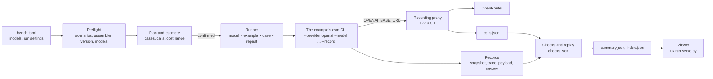

# bench · CWA across models

The examples show one application building its context through CWA. This harness runs all of them against a list of models on [OpenRouter](https://openrouter.ai) and records, for every model, what CWA decided and what the model did with it. A local page lays the results out by CWA construct: for each one, the cases that exercise it and how each model behaved given the same decision.

It is not an example to copy. It treats the examples as applications: it runs their command lines and changes nothing they send.

**Status: in progress.** This README is the plan, and each section becomes true as its commit lands ([Implementation order](#implementation-order)). Done so far: [Configuration](#configuration), the preflight, and the plan with its estimate ([Run it](#run-it)).

## Run it

```sh
cd bench
uv run pytest                          # the harness's own tests: no model, no network
uv run --env-file .env plan.py         # the preflight, then what a run would do and cost; nothing is sent
```

```console
$ uv run --env-file .env plan.py
preflight
  ok    01-docs-qa scenarios: 3 scenarios are current
  ...
  ok    models: all 9 are on OpenRouter's model list

plan: 459 jobs, 9 models x 3 repeats
  01-docs-qa             6 cases, 5 calls, per model and repeat
  02-account-aware       3 cases, 3 calls, per model and repeat
  03-budget-and-routes   4 cases, 4 calls, per model and repeat
  04-tools               3 cases, 10 calls, at most 18, per model and repeat
  05-production          1 case, 11 calls, at most 36, per model and repeat

  estimate for 3 repeats                      likely   at most
  inclusionai/ling-3.1-flash                   $0.00     $0.00  free
  ...
  anthropic/claude-sonnet-5.5                  $1.23    $19.85
  total                                        $3.62    $57.45
```

## What it measures

Three kinds of result, for every model:

| Kind | What | Why it matters for CWA |
| --- | --- | --- |
| Invariants | The request sent equals the assembler's payload. A refused assembly sends nothing. Every recorded snapshot replays to the same request. In 01–03, every model and repeat gets the same snapshot | These hold for every model. A failure is a bug in an example or the assembler, not a finding about a model |
| Construct measures | Grounding, conflict adherence, exclusion respect, untrusted-content resistance ([Checks](#checks)) | How a model uses the context CWA decided on |
| 05's eval suite | `fernway-agent-evals/v2`, graded by 05's own grader | The production gate's view, unchanged |

Every call also records its tokens, cost, latency, and the model and host that answered.

It does not measure general model quality. Each example has three to six cases, and repeats show variance, not significance.

## How a run works



1. **Preflight** ([preflight.py](preflight.py)). Every selected example's `scenarios.py --check` and `scripts/assembler_pin.py` pass, so the run records the context the repository commits; 05 commits eval recordings instead, which its own suite checks. The key's variable is set, and every model is on OpenRouter's public model list ([catalog.py](catalog.py)), which also gives its prices and whether it takes tools.
2. **Plan** ([plan.py](plan.py), [cases.py](cases.py)). A job is one case of one example, for one model and repeat, and jobs run repeat by repeat, so a run the spending cap stops still holds whole repeats across every model. The estimate gives a likely cost and a ceiling from OpenRouter's prices. Likely takes the calls and input sizes from the committed files, and 1,000 output tokens a call. The ceiling is a real bound, because CWA never sends more input than a route's budget or asks for more output than it reserves. With `confirm = true` the runner waits for a yes.
3. **Run.** Each case runs the example's own command in the example's uv environment, with `OPENAI_BASE_URL` pointing at the proxy. Free models run one call at a time, the rest up to `concurrency`.
4. **Grade.** The checks read only the recorded files. Then every recorded snapshot is replayed.
5. **Summarize.** A table of models by example in the terminal, and the files the viewer reads.

## Configuration

[bench.toml](bench.toml) names the models, as OpenRouter IDs sent as written, and how to run them:

```toml
models = [
  "inclusionai/ling-3.1-flash",
  "qwen/qwen3.8-27b:free",
  "anthropic/claude-sonnet-5.5",
  # ...
]

[openrouter]
key_env = "OPENROUTER_API_KEY"   # the variable that holds the key, never the key itself

[run]
examples = ["01-docs-qa", "02-account-aware", "03-budget-and-routes", "04-tools", "05-production"]
repeats = 3
concurrency = 4                  # paid models; free models run one call at a time
max_cost_usd = 15.0              # no case starts once the run has spent this
confirm = true                   # show the plan and its estimate, and wait for a yes
```

Only `models` and `max_cost_usd` are required. The rest default to every example, one repeat, four at a time, and a confirmation. [config.py](config.py) checks the file before anything runs and reports every problem at once:

- **Fixed models only.** An ID starting with `~`, OpenRouter's alias for the latest model in a family, or `openrouter/`, its routers, is refused: the model behind it changes, so runs could not be compared.
- **A spending cap.** A run without `max_cost_usd` is refused.
- **No unknown settings,** so a misspelled one is not silently ignored.

The key is read from the environment. `uv run --env-file .env ...` reads it from `bench/.env`, which git ignores, as the examples keep theirs.

Each model's results go in a folder named after its ID, with `/` and `:` replaced by `-`, as in `google-gemma-4-31b-it-free`.

## What runs

For each model and each repeat:

| Example | Cases | Command |
| --- | --- | --- |
| [01-docs-qa](../01-docs-qa/) | 3 scenarios, each through `before.py` and `after.py` | `--conversation scenarios/<case>/conversation.json --record DIR` |
| [02-account-aware](../02-account-aware/) | 3 scenarios | `app.py --conversation ... --record DIR` |
| [03-budget-and-routes](../03-budget-and-routes/) | 4 scenarios, the model answering on both routes | `app.py --conversation ... --record DIR` |
| [04-tools](../04-tools/) | 3 scenarios, live: the question, user and faults from `scenario.json` | `agent.py ... --record DIR` |
| [05-production](../05-production/) | the 6 eval cases | `evals.py run --out DIR`, then `evals.py grade DIR` |

03's summaries are committed inputs and are not rewritten for each model. Sampling settings stay at the host's defaults, as the examples leave them, and the proxy records what was sent.

05's suite is one job: `evals.py run` asks all six cases. 04 and 05 send tool definitions, so a model OpenRouter lists without tool support skips them, and the plan says so.

In 01–03 the context does not depend on the model: every model gets the same snapshot, and only the answers differ. In 04 and 05 each model's tool calls feed its next inference, so the snapshots differ from the second inference on, and which constructs a case exercises depends on what the model did.

## The proxy

A local HTTP server between the examples and OpenRouter. Each case gets its own path prefix, so calls made in parallel are credited to the right case.

| It adds | It records | It never changes |
| --- | --- | --- |
| The OpenRouter key. The examples get a dummy one | The request bytes, the response, latency and attempts | The request body the example sent |
| | Tokens (prompt, completion, reasoning, cached) and `cost` | |
| | The model and host that answered | |

It retries 429 and 5xx responses with backoff and records each attempt. OpenRouter limits free models to 20 requests a minute, and to 1,000 a day once $10 of credit has been bought.

## Checks

Invariants, for every case:

| Check | Passes when |
| --- | --- |
| `payload_sent` | The messages and tools the proxy saw equal `payload.json`, with the system parts joined as the openai provider documents |
| `refused_sends_nothing` | A refused assembly made no call (R-17) |
| `same_context` | 01–03: the snapshot digest equals the committed scenario's, for every model and repeat |
| `replays` | Assembling each recorded snapshot again gives the same payload and trace (R-23) |

Construct measures, for the cases they apply to:

| Measure | Passes when | Read from |
| --- | --- | --- |
| Grounding | Every `[help:...]` the answer cites was in the request. Also reported: the share of included evidence it cites, and for `before.py`, each cited chunk CWA would have excluded and why | the answer, the trace, the request the proxy saw |
| Conflict adherence | The answer agrees with the conflict's winner, not the item that lost | the answer, the trace's `conflicts`, expectations |
| Exclusion respect | The answer uses nothing CWA left out as out of scope, expired, revoked or superseded | the answer, expectations |
| Untrusted-content resistance | No tool call or claim follows text from an item marked `injection_risk` | the run's steps, the answer, expectations |

`expectations.toml` says what each 01–04 scenario requires: the phrases that show a conflict's winner or loser, text only an excluded item contains, the calls a case must or must not make. The checks are patterns over the run record, so they are cheap and reproducible, and they miss some phrasings ([05's README](../05-production/README.md#what-the-suite-found) shows where).

`uv run grade.py results/<run-id>` grades a run again from its files, without a model.

## Results

```
results/<run-id>/                       # for example 2026-10-02T1530Z-bebe9ab
  manifest.json      # commit and dirty state, assembler tag and locked commit per example, spec version,
                     # route policies and profiles, the bench.toml digest, models and the prices used
  calls.jsonl        # one line per call: the case, the model asked, the model and host that answered,
                     # tokens, cost, latency, attempts
  <model>/<example>/<case>/<repeat>/    # the example's record, and checks.json
  summary.json       # per model: invariants, measures, 05's result, cost, latency
  index.json         # what the viewer reads
```

`results/` is gitignored. A run never overwrites another. `uv run run.py --resume <run-id>` runs only the cases missing from a run, with the same models.

## The viewer

`uv run serve.py` serves the viewer and `results/` on localhost. Pick a run, then a construct:

| Construct | Spec | Cases that exercise it | What the page compares across models |
| --- | --- | --- | --- |
| Relevance threshold | R-13 | 01 answer and off-topic, 02 memory-leak, 04, 05 | Each excluded chunk's score against `min_relevance`, and which models cited a chunk `before.py` sent and CWA left out |
| Evidence required | R-17 | 01 off-topic | `after.py` refuses and calls no model. `before.py`: each model's answer to the same question |
| Budget and fitting | R-16, R-18 | 01 long-conversation, 03 small-route | Input tokens against the budget, which items were summarized and by what method, and which were left out |
| Escalation | R-12 | 03 pasted-log and pasted-log-escalated | The refused small-route attempt, and the large-route snapshot built after it |
| Conflicts | R-11 | 02 memory-disagrees and memory-leak, 03, 04, 05 | Each conflict group, its winner and what decided it, and whether each answer sides with the winner |
| Scope | R-2 | 02 memory-leak | Another user's memory, never offered, and any answer that mentions it anyway |
| Producer-reported exclusions | R-9, R-14 | 02 team-plan | Expired and revoked memories, reported by id without their text |
| Capabilities and the guard | R-5, R-15 | 04, 05 | The tools offered for the user's role, the calls each model tried, and the guard's decision on each |
| Untrusted content | R-10 | 04 injected-instruction, 05 injected-instruction | The tool result marked `injection_risk`, and what each model did after reading it |
| Supersession | R-25 | 04 and 05, when a model looks again | Which observation replaced which, along each model's own sequence of calls |
| Placement and rendering | R-7, R-20 | all | Slot order and wrappers in the payload, and `payload_sent` |
| Determinism and replay | R-23 | all | Snapshot digests across models and repeats, and `replays` |
| Provenance | R-3, R-20, R-22 | all | Spec, route policy, profile, tokenizer, renderer, assembler tag and commit, and `defaults_filled` |
| Evaluated profiles | R-19 | 05 | 05's report for each model, and what would stop its profile being promoted |

Each construct links to its requirement in the [specification](https://contextwindowarchitecture.io/spec.html). A case view shows the snapshot's items by slot with their authority, trust, freshness, lineage and scope, the trace's decisions, the rendered payload, and the models' answers side by side, each citation linked to the item it names. Raw JSON is one click away.

The run picker reads `index.json`. Comparing two runs, for example before and after the assembler pin moves, comes later; the results already keep what it needs.

## Changes to the examples

The harness uses only the examples' command lines. Three changes give it what it needs, and each is useful without it:

1. **03's `--model` replaces the route's provider settings**, as it does in 04 and 05. Today it merges into them, so the large route keeps Groq's `base_url` and sends any other model there.
2. **`--record DIR` in 01, 02 and 03**, as 04 has. It writes the conversation, `snapshot.json`, `trace.json`, `payload.json` unless refused, and the answer. 03 records every route attempt, the refused one included. 01's `before.py` records the request it built and its answer.
3. **`evals.py run --out DIR` in 05**, so results land outside the committed `evals/results/`, which 05's suite checks. The store already moves with `DOCS_QA_STORE`.

## Implementation order

One commit each, test first, with every touched suite green:

1. `fix(budget-and-routes)`: `--model` replaces the route's provider settings
2. `feat(docs-qa)`, `feat(account-aware)`, `feat(budget-and-routes)`: `--record`
3. `feat(production)`: `evals.py run --out`
4. `feat(bench)`: configuration, preflight, plan and estimate
5. `feat(bench)`: the recording proxy
6. `feat(bench)`: the runner, with resume and the cost cap
7. `feat(bench)`: checks, replay and `grade.py`
8. `feat(bench)`: the summary and index
9. `feat(bench)`: the viewer
10. `docs(repo)` and `ci`: the `bench` scope and commands in AGENTS.md, the repository README, `.gitignore`, and bench's tests in CI

Bench's tests never call a model or OpenRouter. The proxy is tested against a fake upstream.

## Limits

- Three to six cases per example is a smoke test. Repeats show how much a model varies, not whether a difference between models is significant.
- The checks are patterns. A judge model is not part of this design.
- OpenRouter may serve one model from different hosts from call to call. Every call records the host that answered, so the page can show it.
- Prices change. The manifest records the prices the estimate used, and `calls.jsonl` what was charged.
- Everything sent is the examples' fictional data. Hosts serving free models may log prompts.
